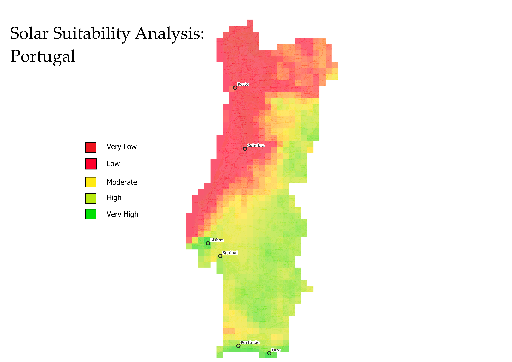
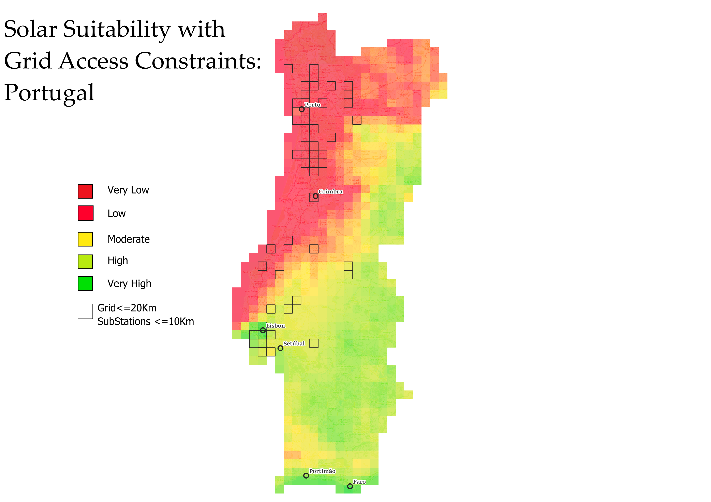

# Portugal Solar Suitability Analysis

## Overview

This project is a GIS-based solar siting analysis for Portugal designed to identify areas that are not only favorable for solar PV development, but also more realistic for utility-scale implementation. Using QGIS, Python, and raster-based multi-criteria analysis, I combined solar irradiance, terrain, population, and grid-access constraints to produce two final outputs: a national solar suitability map and a grid-constrained suitability map.

The project moved beyond a simple “where solar is good” approach by incorporating practical infrastructure considerations through proximity analysis to transmission lines and substations. This made the final output more decision-oriented and helped demonstrate how geospatial analysis can support more realistic renewable energy planning.

## Why This Project Matters

Land suitable for energy development is limited, and utility-scale solar projects are more likely to move forward when they are viable not only environmentally, but also logistically and financially. A national-scale suitability analysis can help narrow down areas where solar development may be more realistic.

This project also shows why grid access matters. Areas with strong solar potential are not equally practical to develop if they are too far from substations or transmission infrastructure. Adding grid constraints makes the analysis more useful for real-world siting decisions.

## Study Area

The study area is **Portugal**.

All analysis was conducted in the projected coordinate system:

**EPSG:3763 — ETRS89 / Portugal TM06**

## Data Sources

### Global Horizontal Irradiance (GHI)
- **Source:** Copernicus Atmosphere Data Store (CAMS Gridded Solar Radiation)
- **Use in project:** represent relative solar resource availability

### Digital Elevation Model (DEM)
- **Source:** Maps for Europe
- **Use in project:** derive slope as a terrain suitability factor

### Population
- **Source:** WorldPop / Humanitarian Data Exchange
- **Use in project:** represent areas with higher population values as a positive factor in the suitability model

### Transmission Lines and Substations
- **Source:** OpenStreetMap via Overpass Turbo
- **Use in project:** represent grid infrastructure access

### Portugal Boundary
- **Source:** administrative boundary layer used for clipping and study-area consistency

# Methodology

## Study Area and Coordinate System

The study area for this project was **Portugal**. All analysis was conducted in the projected coordinate reference system:

**EPSG:3763 — ETRS89 / Portugal TM06**

Using a single projected CRS was important for maintaining consistency across raster analysis, clipping, rasterization, and proximity calculations.

---

## Data Inputs

The project used four main input datasets:

- **Global Horizontal Irradiance (GHI)** from the Copernicus Atmosphere Data Store
- **Digital Elevation Model (DEM)** from Maps for Europe
- **Population** data from WorldPop / Humanitarian Data Exchange
- **Transmission lines and substations** from OpenStreetMap via Overpass Turbo

A Portugal boundary layer was also used to clip all datasets to a consistent study area.

---

## Preprocessing Workflow

### Raster preprocessing

All raster layers were reprojected to **EPSG:3763** using GDAL Warp. After reprojection, the raster layers were aligned to a common grid and clipped to the Portugal boundary.

The DEM was used to derive a **slope raster**, which served as a terrain suitability factor in the final model.

A major focus of preprocessing was ensuring that all raster layers shared:
- the same CRS
- the same extent
- the same cell size
- consistent NoData handling

This was necessary to make the raster calculator and later overlay operations work correctly.

### Vector preprocessing

Transmission lines and substations were reprojected and clipped to Portugal. Features outside the study area were removed through clipping and filtering where needed.

---

## Solar Irradiance Aggregation

The GHI data was originally stored as 15-minute time-series raster data. To create a usable solar input layer for the suitability model, the July GHI observations were aggregated into a single mean raster using Python.

This step was completed with `numpy` and `rasterio`, using a script that:
- read the multi-band raster
- converted NoData values to `NaN`
- calculated the mean across bands
- wrote the result to a new single-band raster

For efficiency, this first version of the project used one month of GHI data rather than a full annual average.

---

## Normalization

Each raster input was normalized to a common **0–1 scale** so that variables with different units and value ranges could be combined in one suitability model.

### Standard min-max normalization

**GHI** and **population** were normalized using standard min-max normalization so that higher raw values received scores closer to **1**.

This reflected the modeling choice to favor:
- areas with higher solar irradiance
- areas with higher population values

### Inverted min-max normalization

**Slope** was normalized using an inverted min-max transformation so that lower slope values, representing flatter terrain, received scores closer to **1**, while steeper terrain received lower scores.

This made flatter land more suitable in the final model.

---

## Weighted Overlay Model

After normalization, the rasters were combined using a weighted overlay model in the QGIS raster calculator.

### Weights used

- **Solar irradiance:** 0.5
- **Population:** 0.3
- **Slope:** 0.2

These weights were assigned based on perceived importance to utility-scale solar suitability, with solar irradiance receiving the highest influence.

The result was a **base solar suitability raster** representing relative suitability across Portugal.

---

## Grid Infrastructure Analysis

To move from a general suitability model toward a more practically useful siting analysis, I added grid-access constraints using transmission lines and substations.

### Grid data extraction

Transmission lines, minor transmission lines, and substations were retrieved from OpenStreetMap using an Overpass Turbo query targeted to Portugal.

### Rasterization of infrastructure layers

Because the raster calculator requires raster inputs, the transmission line and substation vector layers were converted to rasters using the **Rasterize (vector to raster)** tool in QGIS.

These rasters were created using:
- the same CRS as the suitability model
- the same extent as the suitability raster
- the same cell size / resolution as the suitability raster

This ensured that all infrastructure rasters aligned correctly with the base model.

### Distance-to-infrastructure rasters

After rasterization, the **Proximity (raster distance)** tool was used to generate:
- a raster showing distance to transmission lines
- a raster showing distance to substations

These outputs represented the distance from each pixel to the nearest relevant grid feature.

---

## Grid-Constrained Filtering

The distance rasters were then used to filter the base suitability output.

The focused output retained only cells that met both of the following conditions:
- within **10 km** of a substation
- within **20 km** of transmission/grid infrastructure

This created a second map showing suitability areas that were not only favorable based on the weighted overlay model, but also more realistic from a grid-access perspective.

---

## Final Outputs

### Base Solar Suitability Map


### Grid-Constrained Solar Suitability Map


Together, these outputs show the difference between general solar suitability and a more infrastructure-aware view of utility-scale development potential.

---

## Limitations

This first version of the project has several limitations:

- only July GHI data was used rather than a full annual or multi-year average
- model weights were assigned based on judgment rather than formal validation
- population was included as a positive factor without a more specific interpretive framework
- OpenStreetMap infrastructure data may not be complete enough for engineering-grade decisions

Because of these limitations, the project should be interpreted as a portfolio and exploratory siting analysis rather than a final site-selection recommendation.

---

## Future Improvements

Future improvements could include:

- incorporating a full year or multi-year average of solar irradiance
- refining or validating the weighting scheme
- adding more land-use, environmental, or infrastructure constraints
- improving preprocessing efficiency with additional automation
- expanding reproducibility by parameterizing scripts and file paths

## Repository Structure

```text
portugal-solar-suitability/
├── README.md
├── maps/
│   ├── Solar_suitability_PTL.png
│   └── Focused_Suitability_PTL.png
├── scripts/
│   └── ghi_mean.py
├── queries/
│   └── osm_power_infrastructure.overpassql
├── docs/
│   └── methods.md
├── data/
│   ├── raw/
│   └── processed/
└── qgis/
    └── portugal_solar_suitability_project.qgz
